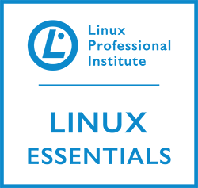
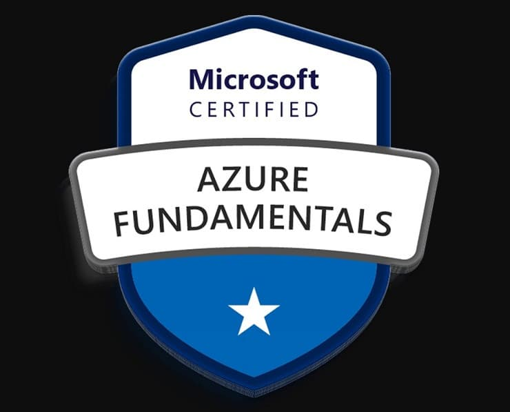
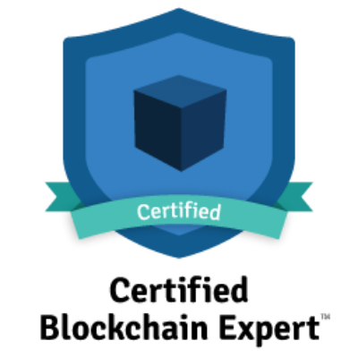

# Hi there, I'm Husain 👋

I'm passionate about building software solutions and continuously expanding my knowledge. I love Linux and will soon pursue the Red Hat Administrator certification and many more.

## About Me

```cpp
#include <iostream>
#include <string>

using namespace std;

class Person {
public:
    string name;
    string passion;
    string location;
    string future_certification;

    Person(string name, string passion, string location, string future_certification) {
        this->name = name;
        this->passion = passion;
        this->location = location;
        this->future_certification = future_certification;
    }

    void introduceYourself() {
        cout << "Hi there, I'm " << name << " 👋" << endl;
        cout << "I'm passionate about " << passion << " and continuously expanding my knowledge." << endl;
        cout << "I love " << location << " and will soon pursue the " << future_certification << " certification and many more." << endl;
    }
};

int main() {
    // Initialize the object
    Person husain("Husain", "building software solutions", "Texas", "Red Hat Administrator");

    // Call the method to print the introduction
    husain.introduceYourself();

    return 0;
}


## Certifications

<div align="center">
  
  
  
</div>

### Linux Essentials Certified
- **Issuer:** Linux Professional Institute (LPI)

### Microsoft Certified: Azure Data Fundamentals
- **Issuer:** Microsoft

### Certified Blockchain Expert
- **Issuer:** Blockchain Council

## Languages and Tools

<div align="center">
    
    
    
    
    
    
    
    
    
</div>


## Connect with Me

<div align="center">
  <a href="https://www.linkedin.com/in/husain-alshaikhahmed-a6892617b">
    
  </a>
</div>
